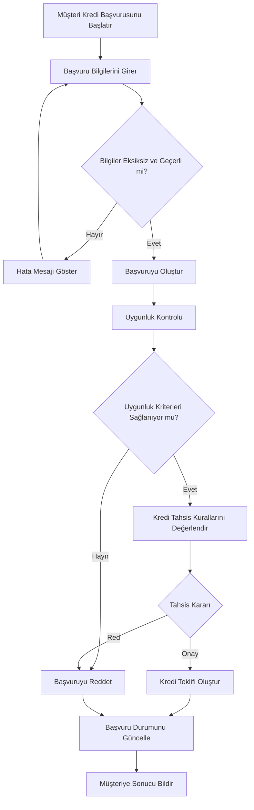

# Credit Application Process Flow

## TO-BE Process Flow

Aşağıdaki akış, müşterinin kredi başvurusundan kredi tahsis kararına kadar olan hedef süreci göstermektedir.

## Süreç Açıklaması

Süreç müşterinin kredi başvurusunu başlatmasıyla başlamaktadır.

Müşterinin girdiği bilgiler öncelikle zorunlu alanlar ve veri formatları açısından kontrol edilir. Eksik veya hatalı bilgi bulunması durumunda müşteriye hata mesajı gösterilir ve bilgilerin düzeltilmesi beklenir.

Bilgiler geçerli olduğunda kredi başvurusu oluşturulur ve uygunluk kontrolleri gerçekleştirilir.

Uygunluk kriterlerini sağlayan başvurular için kredi tahsis kuralları değerlendirilir. Değerlendirme sonucunda başvuru onaylanabilir veya reddedilebilir.

Onaylanan başvurular için kredi teklifi oluşturulur. Başvurunun sonucu sistem üzerinde güncellenir ve müşteriye bildirim gönderilir.

## Process Outcome

Süreç sonunda her kredi başvurusu aşağıdaki durumlardan biriyle sonuçlanır:

* Approved
* Rejected

Başvurunun süreç içerisindeki durumu sistem tarafından izlenebilir şekilde tutulur.
