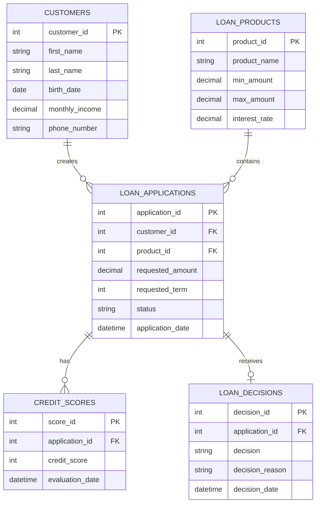

# Database Design

## 1. Genel Bakış

Bu bölümde kredi başvuru ve tahsis sürecinde kullanılacak temel veritabanı yapısı tanımlanmaktadır.

Veritabanı tasarımının amacı; müşteri, kredi ürünü, kredi başvurusu, kredi skoru ve kredi tahsis kararlarına ilişkin bilgilerin ilişkisel bir yapı içerisinde tutulmasını sağlamaktır.

Proje kapsamında aşağıdaki temel tablolar oluşturulmuştur:

* `customers`
* `loan_products`
* `loan_applications`
* `credit_scores`
* `loan_decisions`

## 2. Entity Relationship

Temel ilişkiler aşağıdaki gibidir:



## 3. Customers

`customers` tablosu müşteri bilgilerini tutmaktadır.

| Alan           | Veri Tipi | Açıklama                |
| -------------- | --------- | ----------------------- |
| customer_id    | INT       | Müşteri benzersiz ID'si |
| first_name     | VARCHAR   | Müşteri adı             |
| last_name      | VARCHAR   | Müşteri soyadı          |
| birth_date     | DATE      | Doğum tarihi            |
| monthly_income | DECIMAL   | Aylık gelir             |
| phone_number   | VARCHAR   | Telefon numarası        |

**Primary Key:** `customer_id`

---

## 4. Loan Products

`loan_products` tablosu sistemde sunulan kredi ürünlerini tutmaktadır.

| Alan          | Veri Tipi | Açıklama              |
| ------------- | --------- | --------------------- |
| product_id    | INT       | Ürün benzersiz ID'si  |
| product_name  | VARCHAR   | Kredi ürün adı        |
| min_amount    | DECIMAL   | Minimum kredi tutarı  |
| max_amount    | DECIMAL   | Maksimum kredi tutarı |
| interest_rate | DECIMAL   | Faiz oranı            |

**Primary Key:** `product_id`

---

## 5. Loan Applications

`loan_applications` tablosu müşterilerin kredi başvurularını tutmaktadır.

| Alan             | Veri Tipi | Açıklama                  |
| ---------------- | --------- | ------------------------- |
| application_id   | INT       | Başvuru benzersiz ID'si   |
| customer_id      | INT       | Başvuruyu yapan müşteri   |
| product_id       | INT       | Başvurulan kredi ürünü    |
| requested_amount | DECIMAL   | Talep edilen kredi tutarı |
| requested_term   | INT       | Talep edilen vade         |
| status           | VARCHAR   | Başvuru durumu            |
| application_date | DATETIME  | Başvuru tarihi            |

**Primary Key:** `application_id`

**Foreign Keys:**

* `customer_id → customers.customer_id`
* `product_id → loan_products.product_id`

---

## 6. Credit Scores

`credit_scores` tablosu kredi başvurusuna ilişkin kredi skoru bilgisini tutmaktadır.

| Alan            | Veri Tipi | Açıklama             |
| --------------- | --------- | -------------------- |
| score_id        | INT       | Skor benzersiz ID'si |
| application_id  | INT       | İlgili başvuru       |
| credit_score    | INT       | Kredi skoru          |
| evaluation_date | DATETIME  | Değerlendirme tarihi |

**Primary Key:** `score_id`

**Foreign Key:**

`application_id → loan_applications.application_id`

---

## 7. Loan Decisions

`loan_decisions` tablosu kredi tahsis kararlarını tutmaktadır.

| Alan            | Veri Tipi | Açıklama              |
| --------------- | --------- | --------------------- |
| decision_id     | INT       | Karar benzersiz ID'si |
| application_id  | INT       | İlgili başvuru        |
| decision        | VARCHAR   | Approved / Rejected   |
| decision_reason | VARCHAR   | Karar nedeni          |
| decision_date   | DATETIME  | Karar tarihi          |

**Primary Key:** `decision_id`

**Foreign Key:**

`application_id → loan_applications.application_id`

---

## 8. Relationships

Temel veri ilişkileri aşağıdaki şekilde tanımlanmıştır:

### Customer → Loan Application

Bir müşteri birden fazla kredi başvurusu oluşturabilir.

```text
Customer 1 ─────── N Loan Applications
```

### Loan Product → Loan Application

Bir kredi ürünü birden fazla kredi başvurusunda kullanılabilir.

```text
Loan Product 1 ─────── N Loan Applications
```

### Loan Application → Credit Score

Bir kredi başvurusunun bir veya daha fazla değerlendirme skoru bulunabilir.

```text
Loan Application 1 ─────── N Credit Scores
```

### Loan Application → Loan Decision

Bir kredi başvurusunun tahsis sürecinde bir karar kaydı bulunabilir.

```text
Loan Application 1 ─────── 0..1 Loan Decision
```

## 9. Data Analysis Perspective

İş Analisti açısından bu veri modeli;

* Kredi başvurularının takip edilmesini,
* Başvuru durumlarının analiz edilmesini,
* Müşteri ve başvuru bilgilerinin ilişkilendirilmesini,
* Kredi skorlarının incelenmesini,
* Tahsis kararlarının analiz edilmesini

desteklemektedir.

Bu yapı üzerinde SQL sorguları kullanılarak iş biriminin ihtiyaç duyduğu rapor ve analizler gerçekleştirilebilir.
