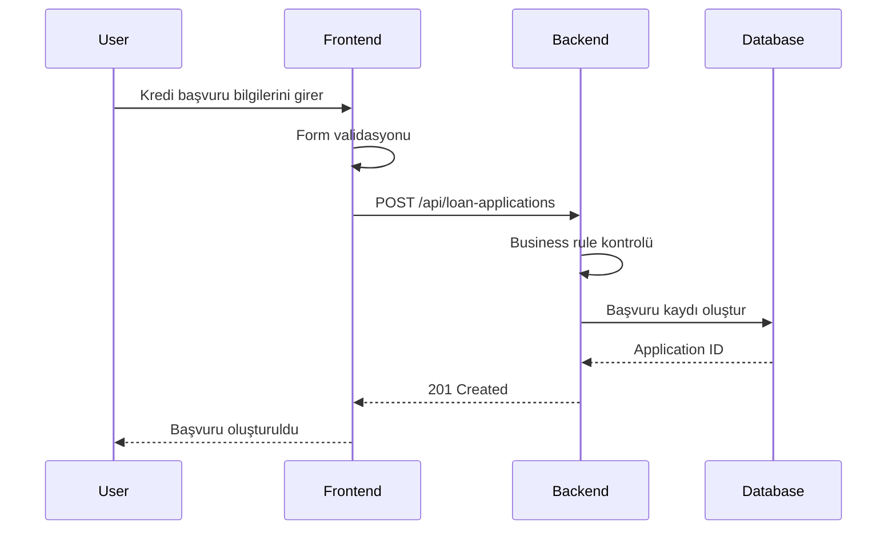

# API Analysis – Loan Allocation System

## 1. Amaç

Bu dokümanın amacı, dijital kredi başvuru ve kredi tahsis sürecinde kullanılabilecek REST API servislerinin analizini ve teknik gereksinimlerini tanımlamaktır.

API analizi kapsamında;

* HTTP metodunun belirlenmesi
* Endpoint yapısının tanımlanması
* Request ve Response yapılarının incelenmesi
* HTTP status code'ların belirlenmesi
* Validasyon kurallarının tanımlanması
* Hata senaryolarının belirlenmesi
* Frontend ve backend arasındaki veri akışının açıklanması

ele alınmıştır.

> Bu projedeki API'ler tamamen kurgusaldır ve herhangi bir gerçek şirket veya sistem verisi kullanılmamıştır.

---

## 2. API Genel Akışı

Kredi başvuru sürecindeki temel API akışı aşağıdaki gibidir:

```text
Kullanıcı
   |
   v
Frontend
   |
   | POST /api/loan-applications
   v
Backend
   |
   | Başvuru oluşturma
   v
Database
   |
   v
Application ID
   |
   v
Frontend
```

Başvuru oluşturulduktan sonra kullanıcı başvurunun durumunu API üzerinden görüntüleyebilir.

```text
Frontend
   |
   | GET /api/loan-applications/{applicationId}/status
   v
Backend
   |
   v
Database
   |
   v
Application Status
```

---

# 3. API Endpoints

| Method | Endpoint                                          | Açıklama                                            |
| ------ | ------------------------------------------------- | --------------------------------------------------- |
| POST   | `/api/loan-applications`                          | Yeni kredi başvurusu oluşturur.                     |
| GET    | `/api/loan-applications/{applicationId}`          | Belirli bir kredi başvurusunun detaylarını getirir. |
| GET    | `/api/loan-applications/{applicationId}/status`   | Kredi başvurusunun mevcut durumunu getirir.         |
| GET    | `/api/loan-applications/{applicationId}/decision` | Kredi tahsis kararını getirir.                      |

---

# 4. Create Loan Application

## Endpoint

```http
POST /api/loan-applications
```

## Amaç

Müşterinin kredi başvurusunu sisteme iletmek ve yeni bir kredi başvurusu oluşturmaktır.

## Request

```json
{
  "customerId": 1001,
  "productId": 101,
  "requestedAmount": 75000,
  "requestedTerm": 24
}
```

### Request Alanları

| Alan            | Tip     | Zorunlu | Açıklama                  |
| --------------- | ------- | ------- | ------------------------- |
| customerId      | Integer | Evet    | Müşteri kimliği           |
| productId       | Integer | Evet    | Kredi ürünü kimliği       |
| requestedAmount | Decimal | Evet    | Talep edilen kredi tutarı |
| requestedTerm   | Integer | Evet    | Kredi vadesi              |

## Validasyonlar

* `customerId` boş olmamalıdır.
* `productId` boş olmamalıdır.
* `requestedAmount` 0'dan büyük olmalıdır.
* `requestedTerm` 0'dan büyük olmalıdır.
* Müşteri sistemde mevcut olmalıdır.
* Kredi ürünü sistemde mevcut olmalıdır.
* Talep edilen tutar, ürünün maksimum kredi tutarını aşmamalıdır.
* Aynı müşteri ve ürün için aktif bir başvuru bulunmamalıdır.

Bu kontrollerin bir kısmı frontend tarafında kullanıcıya erken geri bildirim sağlamak amacıyla yapılabilir. Backend tarafında ise kurallar tekrar kontrol edilmelidir.

## Başarılı Response

### HTTP 201 – Created

```json
{
  "applicationId": 50001,
  "status": "SUBMITTED",
  "message": "Loan application created successfully."
}
```

## Hata Örneği

### HTTP 400 – Bad Request

```json
{
  "errorCode": "INVALID_REQUEST",
  "message": "Requested amount must be greater than 0."
}
```

### HTTP 404 – Not Found

```json
{
  "errorCode": "CUSTOMER_NOT_FOUND",
  "message": "Customer was not found."
}
```

### HTTP 409 – Conflict

```json
{
  "errorCode": "ACTIVE_APPLICATION_EXISTS",
  "message": "An active application already exists for this customer and product."
}
```

---

# 5. Get Loan Application

## Endpoint

```http
GET /api/loan-applications/{applicationId}
```

## Amaç

Belirli bir kredi başvurusuna ait bilgileri görüntülemektir.

## Request

```http
GET /api/loan-applications/50001
```

## Response

### HTTP 200 – OK

```json
{
  "applicationId": 50001,
  "customerId": 1001,
  "productId": 101,
  "requestedAmount": 75000,
  "requestedTerm": 24,
  "status": "UNDER_EVALUATION",
  "applicationDate": "2026-09-15"
}
```

## Hata Senaryosu

### HTTP 404 – Not Found

```json
{
  "errorCode": "APPLICATION_NOT_FOUND",
  "message": "Loan application was not found."
}
```

---

# 6. Get Application Status

## Endpoint

```http
GET /api/loan-applications/{applicationId}/status
```

## Amaç

Müşterinin kredi başvurusunun mevcut durumunu görüntülemektir.

## Response

### HTTP 200 – OK

```json
{
  "applicationId": 50001,
  "status": "APPROVED",
  "statusDescription": "Loan application has been approved."
}
```

## Başvuru Durumları

```text
SUBMITTED
    |
    v
UNDER_EVALUATION
    |
    +------> REJECTED
    |
    v
APPROVED
    |
    v
OFFER_CREATED
```

---

# 7. Get Loan Decision

## Endpoint

```http
GET /api/loan-applications/{applicationId}/decision
```

## Amaç

Kredi başvurusuna ait tahsis kararını görüntülemektir.

## Response – Approved

```json
{
  "applicationId": 50001,
  "decision": "APPROVED",
  "decisionReason": "Application meets allocation criteria.",
  "decisionDate": "2026-09-15"
}
```

## Response – Rejected

```json
{
  "applicationId": 50002,
  "decision": "REJECTED",
  "decisionReason": "Credit score is below the required threshold.",
  "decisionDate": "2026-09-15"
}
```

---

# 8. HTTP Status Codes

API servislerinde kullanılabilecek temel HTTP status code'lar aşağıdaki gibidir:

| Status Code | Anlamı                | Kullanım                              |
| ----------- | --------------------- | ------------------------------------- |
| 200         | OK                    | Başarılı veri sorgulama               |
| 201         | Created               | Yeni başvuru oluşturuldu              |
| 400         | Bad Request           | Geçersiz request                      |
| 401         | Unauthorized          | Kimlik doğrulama başarısız            |
| 403         | Forbidden             | Kullanıcının işlem yetkisi bulunmuyor |
| 404         | Not Found             | Kayıt bulunamadı                      |
| 409         | Conflict              | Mevcut kayıt veya iş kuralı çakışması |
| 500         | Internal Server Error | Beklenmeyen sistem hatası             |

---

# 9. Business Rules – API İlişkisi

API validasyonları business rule'larla ilişkilendirilmelidir.

Örneğin:

| Business Rule | API Kontrolü                                           |
| ------------- | ------------------------------------------------------ |
| BR-001        | Zorunlu müşteri ve başvuru bilgilerinin kontrolü       |
| BR-002        | Gelirin 0'dan büyük olması                             |
| BR-003        | Müşteri yaşının en az 18 olması                        |
| BR-004        | Aktif başvuru kontrolü                                 |
| BR-007        | Talep edilen tutarın ürün limitini aşmaması            |
| BR-008        | Uygun başvurunun tahsis değerlendirmesine gönderilmesi |

Bu yapı sayesinde API davranışları ile iş kuralları arasında izlenebilirlik sağlanır.

---

# 10. Frontend – Backend Veri Akışı

Kredi başvuru ekranında kullanıcı bilgileri girdikten sonra frontend tarafından backend'e request gönderilir.



---

# 11. Error Handling

API'lerde hata mesajlarının standart bir formatta dönmesi hedeflenmiştir.

Örnek:

```json
{
  "errorCode": "INVALID_REQUEST",
  "message": "Requested amount must be greater than 0."
}
```

Standart hata yapısının kullanılması;

* Frontend tarafında hata mesajlarının daha kolay yönetilmesini
* QA testlerinin standartlaştırılmasını
* Hataların analiz edilmesini
* Kullanıcıya daha anlaşılır geri bildirim verilmesini

sağlar.

---

# 12. BA Perspektifinden API Analizi

İş Analisti açısından API analizi yalnızca endpoint listesinin oluşturulmasından ibaret değildir.

API analizi sırasında aşağıdaki sorular ele alınmalıdır:

* Hangi işlem için API'ye ihtiyaç var?
* Hangi HTTP metodu kullanılmalı?
* Request içerisinde hangi alanlar bulunmalı?
* Hangi alanlar zorunlu?
* Alanların veri tipleri nedir?
* Hangi business rule'lar uygulanmalı?
* Başarılı durumda hangi response dönmeli?
* Hangi hata senaryoları bulunuyor?
* Hangi HTTP status code kullanılmalı?
* Frontend ve backend arasında hangi veri akışı gerçekleşiyor?
* API'nin oluşturduğu veya güncellediği veri hangi tabloda tutuluyor?
* API davranışı hangi requirement ile ilişkilendiriliyor?

Bu yaklaşım, iş gereksinimleri ile teknik çözüm arasındaki bağlantının kurulmasına yardımcı olur.

---

# 13. Requirement Traceability

API analizinin functional requirement'larla ilişkisi:

| API                                                   | Requirement                            |
| ----------------------------------------------------- | -------------------------------------- |
| `POST /api/loan-applications`                         | FR-001, FR-002, FR-003, FR-004, FR-005 |
| `GET /api/loan-applications/{applicationId}`          | FR-012, FR-014                         |
| `GET /api/loan-applications/{applicationId}/status`   | FR-012                                 |
| `GET /api/loan-applications/{applicationId}/decision` | FR-009                                 |

Bu ilişkilendirme sayesinde bir requirement'ın API, test ve UAT aşamalarında takip edilmesi kolaylaşır.

---

# 14. API Analysis Checklist

* [x] HTTP method belirlendi.
* [x] Endpoint yapısı tanımlandı.
* [x] Request alanları belirlendi.
* [x] Response yapıları tanımlandı.
* [x] Zorunlu alanlar belirlendi.
* [x] Business rule kontrolleri tanımlandı.
* [x] HTTP status code'lar belirlendi.
* [x] Hata senaryoları tanımlandı.
* [x] Frontend-backend veri akışı oluşturuldu.
* [x] Requirement bağlantıları kuruldu.
* [x] API analizi BA perspektifiyle dokümante edildi.
