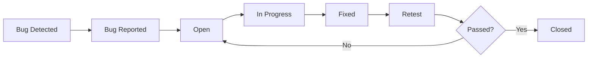

# Bug Reports – Loan Allocation System

## 1. Amaç

Bu dokümanın amacı, kredi başvuru ve kredi tahsis sisteminde tespit edilebilecek hataların standart bir formatta raporlanmasını sağlamaktır.

Bug report içerisinde aşağıdaki bilgiler bulunmaktadır:

* Bug ID
* İlgili Test Case
* Başlık
* Öncelik
* Severity
* Ortam
* Ön koşullar
* Reproduce adımları
* Beklenen sonuç
* Gerçekleşen sonuç
* Hatanın etkisi
* Durum

> Bu dokümandaki bug kayıtları eğitim ve portföy amacıyla oluşturulmuş kurgusal örneklerdir.

---

# 2. Bug Severity

| Severity | Açıklama                                                                         |
| -------- | -------------------------------------------------------------------------------- |
| Critical | Sistemin temel işlevini engelleyen veya ciddi veri/işlem problemi oluşturan hata |
| High     | Önemli bir işlevin çalışmasını engelleyen hata                                   |
| Medium   | İşlev çalışıyor ancak beklenmeyen davranış oluşuyor                              |
| Low      | Kullanıcı deneyimini veya küçük bir işlevi etkileyen hata                        |

---

# 3. Bug Priority

| Priority | Açıklama                                       |
| -------- | ---------------------------------------------- |
| Critical | Acil olarak ele alınması gereken hata          |
| High     | Öncelikli olarak düzeltilmesi gereken hata     |
| Medium   | Planlanan geliştirme kapsamında ele alınabilir |
| Low      | Daha düşük öncelikli hata                      |

---

# 4. BUG-001 – Negatif Kredi Tutarının Kabul Edilmesi

**Bug ID:** BUG-001
**Related Test Case:** TC-003
**Severity:** High
**Priority:** High
**Environment:** Test Environment
**Status:** Open

## Başlık

Kredi başvuru formunda negatif kredi tutarı girildiğinde sistem başvurunun ilerlemesine izin veriyor.

## Ön Koşullar

* Kullanıcı kredi başvuru ekranına erişebilmelidir.
* Kredi ürünü aktif olmalıdır.

## Test Verisi

```text
Requested Amount: -5.000 TL
```

## Reproduce Adımları

1. Kredi başvuru ekranı açılır.
2. Geçerli müşteri bilgileri girilir.
3. Geçerli kredi ürünü seçilir.
4. Kredi tutarı alanına `-5.000` girilir.
5. Vade bilgisi girilir.
6. Başvuru gönderilir.

## Beklenen Sonuç

Sistem negatif kredi tutarını kabul etmemelidir.

Kullanıcıya uygun bir validation mesajı gösterilmelidir.

Örneğin:

```text
Kredi tutarı 0'dan büyük olmalıdır.
```

## Gerçekleşen Sonuç

Sistem negatif kredi tutarını kabul ederek başvuru işleminin devam etmesine izin vermektedir.

## Etki

Geçersiz finansal verinin sisteme gönderilmesine neden olabilir.

## Durum

`Open`

---

# 5. BUG-002 – Olmayan Müşteri İçin Başvuru Oluşturulması

**Bug ID:** BUG-002
**Related Test Case:** TC-007
**Severity:** Critical
**Priority:** Critical
**Environment:** Test Environment
**Status:** Open

## Başlık

Sistemde bulunmayan müşteri ID'si ile kredi başvurusu oluşturulabiliyor.

## Ön Koşullar

Customer ID:

```text
999999
```

sistemde bulunmamalıdır.

## Reproduce Adımları

1. API endpoint'e POST request gönderilir.
2. `customerId` alanına `999999` gönderilir.
3. Diğer alanlara geçerli bilgiler girilir.
4. Response kontrol edilir.

## Request

```json
{
  "customerId": 999999,
  "productId": 101,
  "requestedAmount": 75000,
  "requestedTerm": 24
}
```

## Beklenen Sonuç

API:

```text
404 Not Found
```

döndürmelidir.

Başvuru oluşturulmamalıdır.

## Gerçekleşen Sonuç

API:

```text
201 Created
```

döndürmekte ve başvuru oluşturmaktadır.

## Etki

Sistemde geçersiz bir müşteri ile ilişkilendirilmiş kredi başvurusu oluşmasına neden olabilir.

## Durum

`Open`

---

# 6. BUG-003 – Başvuru Status Değerinin Güncellenmemesi

**Bug ID:** BUG-003
**Related Test Case:** TC-013
**Severity:** High
**Priority:** High
**Environment:** Test Environment
**Status:** Open

## Başlık

Kredi başvurusu onaylandığında application status değeri `APPROVED` olarak güncellenmiyor.

## Ön Koşullar

Başvuru tüm kredi tahsis kriterlerini sağlamalıdır.

## Test Verisi

```text
Age: 30
Credit Score: 1450
Monthly Income: 50.000 TL
Monthly Installment: 20.000 TL
Requested Amount: 75.000 TL
```

## Reproduce Adımları

1. Kredi başvurusu oluşturulur.
2. Uygunluk kontrolleri gerçekleştirilir.
3. Kredi tahsis kararı oluşturulur.
4. Karar `APPROVED` olarak kaydedilir.
5. `loan_applications` tablosundaki status alanı kontrol edilir.

## Beklenen Sonuç

Başvuru status değeri:

```text
APPROVED
```

olmalıdır.

## Gerçekleşen Sonuç

Decision kaydı `APPROVED` olmasına rağmen `loan_applications.status` alanı:

```text
UNDER_EVALUATION
```

olarak kalmaktadır.

## Etki

Frontend'de müşteriye yanlış başvuru durumu gösterilebilir.

Ayrıca sonraki süreçlerde status üzerinden çalışan işlemler doğru şekilde tetiklenmeyebilir.

## Durum

`Open`

---

# 7. BUG-004 – Application Status API Eski Durumu Döndürüyor

**Bug ID:** BUG-004
**Related Test Case:** TC-017
**Severity:** Medium
**Priority:** High
**Environment:** Test Environment
**Status:** Open

## Başlık

Application status API'si database'deki güncel durum yerine eski başvuru durumunu döndürüyor.

## Reproduce Adımları

1. Application ID `50001` oluşturulur.
2. Başvuru status değeri `SUBMITTED` olarak kaydedilir.
3. Başvuru değerlendirilir.
4. Başvuru `APPROVED` durumuna getirilir.
5. Status API çağrılır.

```http
GET /api/loan-applications/50001/status
```

## Beklenen Sonuç

API:

```json
{
  "applicationId": 50001,
  "status": "APPROVED"
}
```

döndürmelidir.

## Gerçekleşen Sonuç

API:

```json
{
  "applicationId": 50001,
  "status": "SUBMITTED"
}
```

döndürmektedir.

## Etki

Kullanıcıya başvurusunun güncel durumu yanlış gösterilebilir.

## Durum

`Open`

---

# 8. BUG-005 – Ürün Maksimum Limitinin Kontrol Edilmemesi

**Bug ID:** BUG-005
**Related Test Case:** TC-012
**Severity:** High
**Priority:** High
**Environment:** Test Environment
**Status:** Open

## Başlık

Talep edilen kredi tutarı ürün maksimum limitini aşmasına rağmen sistem başvuruyu kabul ediyor.

## Test Verisi

```text
Product Maximum Amount: 100.000 TL
Requested Amount: 150.000 TL
```

## Reproduce Adımları

1. Kredi başvuru ekranı açılır.
2. Ürün seçilir.
3. Kredi tutarı `150.000 TL` olarak girilir.
4. Başvuru gönderilir.
5. Tahsis sonucu kontrol edilir.

## Beklenen Sonuç

Başvuru reddedilmelidir.

```text
Decision: REJECTED
```

## Gerçekleşen Sonuç

Sistem başvuruyu kabul ederek değerlendirme sürecine devam etmektedir.

## Etki

Ürün bazında tanımlanan kredi limitinin aşılmasına neden olabilir.

## İlgili Business Rule

```text
BR-007: Talep edilen kredi tutarı ürünün maksimum limitini aşmamalıdır.
```

## Durum

`Open`

---

# 9. Bug Lifecycle

Bug'ların yaşam döngüsü aşağıdaki şekilde yönetilebilir:



## Açıklama

**Bug Detected**

Test sırasında hata tespit edilir.

**Bug Reported**

Hata detayları bug report olarak oluşturulur.

**Open**

Bug geliştirme ekibinin incelemesini bekler.

**In Progress**

Geliştirici hata üzerinde çalışmaktadır.

**Fixed**

Geliştirici hatayı düzelttiğini belirtir.

**Retest**

QA veya ilgili ekip tarafından hata tekrar test edilir.

**Closed**

Hata düzeltmesi doğrulanmıştır.

**Reopened**

Retest sırasında hata devam ediyorsa bug tekrar açılır.

---

# 10. BA'nın Bug Management Sürecindeki Rolü

İş Analisti, hata yönetimi sürecinde geliştirme ve test ekipleri arasında iletişimi destekleyebilir.

BA açısından önemli noktalar:

* Hatanın hangi requirement ile ilişkili olduğunu belirlemek
* Business rule ile uyumsuzluğu tespit etmek
* Beklenen ve gerçekleşen davranışı netleştirmek
* Gerekirse acceptance criteria'yı gözden geçirmek
* Geliştiriciye gerekli iş bağlamını sağlamak
* QA ile test kapsamını değerlendirmek
* Hatanın düzeltilmesinden sonra retest sürecini takip etmek
* Requirement → User Story → Test Case → Bug bağlantısını korumak

Örneğin:

```text
FR-007
  ↓
US-005
  ↓
BR-007
  ↓
TS-012
  ↓
TC-012
  ↓
BUG-005
```

Bu bağlantı, hatanın hangi iş gereksiniminden kaynaklandığının takip edilmesini sağlar.

---

# 11. Bug Report Checklist

* [x] Bug ID oluşturuldu.
* [x] İlgili test case belirtildi.
* [x] Bug başlığı tanımlandı.
* [x] Severity belirlendi.
* [x] Priority belirlendi.
* [x] Ön koşullar tanımlandı.
* [x] Reproduce adımları yazıldı.
* [x] Beklenen sonuç belirtildi.
* [x] Gerçekleşen sonuç belirtildi.
* [x] İş etkisi açıklandı.
* [x] İlgili business rule belirtildi.
* [x] Bug lifecycle tanımlandı.
* [x] BA'nın bug management sürecindeki rolü açıklandı.
