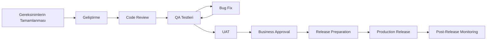

# Release Management Plan

## 1. Amaç

Bu dokümanın amacı, dijital kredi başvuru ve tahsis sisteminin geliştirme, test, UAT ve canlıya geçiş süreçlerinin kontrollü şekilde yönetilmesini tanımlamaktır.

Release sürecinde gereksinimlerin karşılanması, test sonuçlarının değerlendirilmesi, UAT onayının alınması ve canlıya geçiş öncesi kontrollerin tamamlanması hedeflenmektedir.

---

## 2. Release Kapsamı

Bu release kapsamında aşağıdaki fonksiyonların kullanıma sunulması planlanmaktadır:

* Kredi başvurusu oluşturma
* Müşteri bilgilerinin alınması
* Zorunlu alan ve veri formatı kontrolleri
* Kredi uygunluk kontrolü
* Kredi tahsis kurallarının değerlendirilmesi
* Kredi tahsis kararı
* Başvuru statüsünün güncellenmesi
* Kredi teklifi oluşturulması
* Başvuru durumunun görüntülenmesi
* Başvuru geçmişinin görüntülenmesi
* Müşteri bildirimleri

---

## 3. Release Süreci



Release sürecinde testlerde tespit edilen hatalar giderildikten sonra ilgili testlerin tekrar çalıştırılması ve gerekli durumlarda regression testlerinin gerçekleştirilmesi planlanmaktadır.

---

## 4. Release Öncesi Kontroller

Canlıya geçiş öncesinde aşağıdaki kontroller gerçekleştirilmelidir:

* [ ] Gereksinimler tamamlandı
* [ ] User Story ve Acceptance Criteria'lar karşılandı
* [ ] Geliştirme tamamlandı
* [ ] Code Review tamamlandı
* [ ] QA testleri tamamlandı
* [ ] Critical seviyede açık bug bulunmuyor
* [ ] High seviyedeki buglar değerlendirildi
* [ ] Regression testleri tamamlandı
* [ ] UAT tamamlandı
* [ ] Business Stakeholder onayı alındı
* [ ] Veritabanı kontrolleri tamamlandı
* [ ] API kontrolleri tamamlandı
* [ ] Release notları hazırlandı
* [ ] Rollback planı hazırlandı
* [ ] İlgili ekipler bilgilendirildi

---

## 5. Release Rolleri

| Rol                  | Sorumluluk                                                            |
| -------------------- | --------------------------------------------------------------------- |
| Business Analyst     | Gereksinimlerin ve iş beklentilerinin takip edilmesi                  |
| Product Owner        | Ürün önceliklerinin ve release kapsamının yönetilmesi                 |
| Development Team     | Geliştirme ve teknik düzeltmeler                                      |
| QA Team              | Fonksiyonel, entegrasyon ve regression testlerinin gerçekleştirilmesi |
| Business Stakeholder | UAT ve iş kabulünün gerçekleştirilmesi                                |
| Operations           | Release ve canlı ortam operasyonlarının desteklenmesi                 |

---

## 6. BA'nın Release Sürecindeki Rolü

Business Analyst release sürecinde gereksinimlerin doğru şekilde karşılandığının takip edilmesine destek olur.

BA'nın temel sorumlulukları:

* Release kapsamındaki gereksinimleri takip etmek
* User Story ve Acceptance Criteria'ların karşılandığını kontrol etmek
* Test sonuçlarını gereksinimlerle ilişkilendirmek
* UAT sürecini desteklemek
* İş birimlerinden gelen geri bildirimleri değerlendirmek
* Bugların iş etkisinin anlaşılmasına destek olmak
* Gereksinim değişikliklerinin etkisini analiz etmek
* Release öncesi iş beklentilerinin karşılandığını doğrulamak
* Release sonrasında ortaya çıkan iş problemlerinin analizine destek olmak

---

## 7. Release Entry Criteria

Release sürecinin başlayabilmesi için aşağıdaki koşulların sağlanması beklenmektedir:

1. Geliştirme kapsamındaki User Story'ler tamamlanmış olmalıdır.
2. Acceptance Criteria'lar karşılanmış olmalıdır.
3. QA testleri tamamlanmış olmalıdır.
4. Kritik seviyede açık bug bulunmamalıdır.
5. UAT için gerekli ortam ve test verileri hazır olmalıdır.
6. UAT senaryoları tamamlanmış olmalıdır.
7. İş biriminin release kapsamından haberdar olması sağlanmalıdır.

---

## 8. Release Exit Criteria

Release'in tamamlanabilmesi için:

1. Planlanan fonksiyonların canlıya alınmış olması,
2. Kritik fonksiyonların kontrol edilmesi,
3. Gerekli smoke testlerinin tamamlanması,
4. Kritik bir hata bulunmaması,
5. Release sonuçlarının ilgili ekiplerle paylaşılması,
6. Gerekli dokümantasyonun güncellenmesi

beklenmektedir.

---

## 9. Rollback Planı

Canlıya geçiş sonrasında kritik bir problem tespit edilmesi durumunda rollback süreci değerlendirilebilir.

Örnek rollback adımları:

```text
Production Problem
        ↓
Problem Assessment
        ↓
Business Impact Analysis
        ↓
Rollback Decision
        ↓
Previous Stable Version
        ↓
Smoke Test
        ↓
Business Verification
        ↓
Incident Follow-up
```

Rollback kararı, problemin teknik ve iş etkisi değerlendirilerek ilgili ekiplerin ortak kararıyla alınmalıdır.

---

## 10. Post-Release Monitoring

Release sonrasında aşağıdaki alanların takip edilmesi planlanmaktadır:

* Kredi başvuru sayıları
* Başarılı ve başarısız başvuru oranları
* API hata oranları
* Başvuru statülerindeki beklenmeyen değişiklikler
* Kredi tahsis kararları
* Kredi teklifi oluşturma durumu
* Kullanıcı geri bildirimleri
* Kritik sistem hataları

Beklenmeyen bir durum tespit edildiğinde ilgili ekiplerle iletişime geçilerek analiz ve aksiyon süreci başlatılır.

---

## 11. Release Communication

Release öncesinde ve sonrasında ilgili ekiplerin bilgilendirilmesi planlanmaktadır.

### Release Öncesi

* Release kapsamı
* Planlanan release tarihi
* Test ve UAT durumu
* Açık buglar
* Bilinen kısıtlar
* Rollback planı

### Release Sonrası

* Release'in tamamlandığı bilgisi
* Yapılan değişiklikler
* Smoke test sonuçları
* Bilinen problemler
* Gerekli takip aksiyonları

---

## 12. Release Summary

Bu proje kapsamında release yönetimi;

**Requirement → Development → QA → Bug Fix → UAT → Business Approval → Release → Post-Release Monitoring**

akışı üzerinden ele alınmıştır.

Amaç yalnızca sistemi canlıya almak değil, iş gereksinimlerinin karşılandığını doğrulayarak kontrollü ve izlenebilir bir release süreci yürütmektir.
